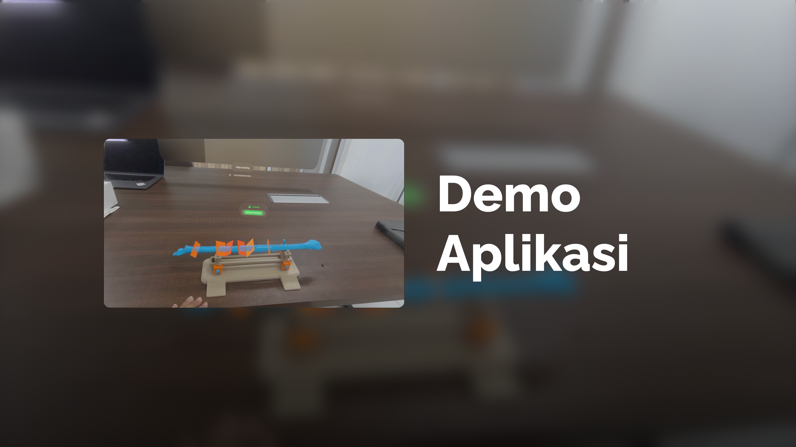

# 🏁 Tugas Akhir (TA) - Final Project

**Nama Mahasiswa**: Mohammad Zhafran Dzaky  
**NRP**: 5025211142  
**Judul TA**: Pengembangan Aplikasi Augmented Reality untuk Panduan Osteotomi Fibula pada Platform iOS dan visionOS  
**Dosen Pembimbing**: Hadziq Fabroyir, S.Kom., Ph.D.  
**Dosen Ko-pembimbing**: Djoko Kuswanto, S.T., M.Biotech.

---

## 📺 Demo Aplikasi

[](https://youtu.be/pWtIT9mHsf4)  
_Klik gambar di atas untuk menonton demo_

---

## 🛠 Panduan Instalasi & Menjalankan Software

### Prasyarat

- Daftar perangkat:
  - Macbook
  - Xcode (16.0 or latest)
  - iOS (iPhone atau iPad)
  - visionOS (Apple Vision Pro)
- Daftar dependensi:
  - Swift 5
  - iOS 18.0
  - visionOS 2.0

### Langkah-langkah

1. **Clone Repository**
   ```bash
   git clone https://github.com/Informatics-ITS/TA.git
   ```
2. **Buka Proyek di Xcode**

   - Xcode -> file -> open -> pilih path di repo proyek [ios/visionos].
   - atau buka lewat launch screen Xcode dengan memilih direktori yang sesuai.

3. **Jalankan Aplikasi**
   - Hubungkan perangkat target ke xcode macbook (iPhone menggunakan kabel type-C, Apple Vision Pro menggunakan **_developer straps_** atau via koneksi wifi berprotokol **_Bonjour_** yang sama dengan macbook).
   - Pilih perangkat destinasi sesuai pilihan proyek dan perangkat yang telah disambungkan ke xcode macbook.
   - Klik tombol _build and run_.

---

## 📚 Dokumentasi Tambahan

- ### Tahapan dan Arsitektur Sistem
  

---

## ✅ Validasi

Pastikan proyek memenuhi kriteria berikut sebelum submit:

- [x] Source code dapat di-build/run tanpa error
- [x] Video demo jelas menampilkan fitur utama
- [x] README lengkap dan terupdate
- [x] Tidak ada data sensitif (password, API key) yang ter-expose

---

## ⁉️ Pertanyaan?

Hubungi:

- Penulis: zhafrandzaky[at]gmail.com
- Pembimbing Utama: hadziq[at]its.ac.id
